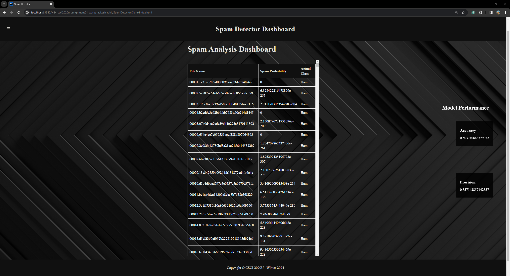

# Spam Detector

## Project Information
This project aims to create a spam detector using a unigram approach to filter out spam emails. The program uses a dataset of emails (spam or ham) to train the system, calculating probabilities based on each word's frequency.

### Screenshots

#### Dashboard


#### About Me Page


### Group Members
- [Your Name]
- [Group Member 2 Name]
- [Group Member 3 Name]

## How to Run
1. Clone the repository:
    ```bash
    git clone <repository-url>
    cd <repository-folder>
    ```

2. Open the project in your preferred IDE (IntelliJ is recommended).

3. Navigate to the `SpamDetectorServer` project to access the training and testing data in the `resources` folder.

4. Run the server to train and test the spam detector.

5. Open the `SpamDetectorClient` project to interact with the spam detector.

## Unigram Approach
The spam detector utilizes a unigram approach, where each word is counted and associated with whether the message is spam. The program calculates probabilities based on each word's frequency.

## Project Structure
The project is divided into two main components:
- **SpamDetectorServer:** Handles the training and testing of the spam detector.
- **SpamDetectorClient:** Provides the interface for interacting with the spam detector.

## Data
The training and testing data are located in the `resources` folder of the `SpamDetectorServer` project. The data is divided into two folders: `train` and `test`.

## How to Submit
Follow the instructions in the "How to Submit / GitHub Classroom Assignment" section at the end of the template repository for information on forming a group and submitting your assignment.

## References
[1] Unigram Approach: [Link to more information]
[2] Word Frequency: [Link to more information]
