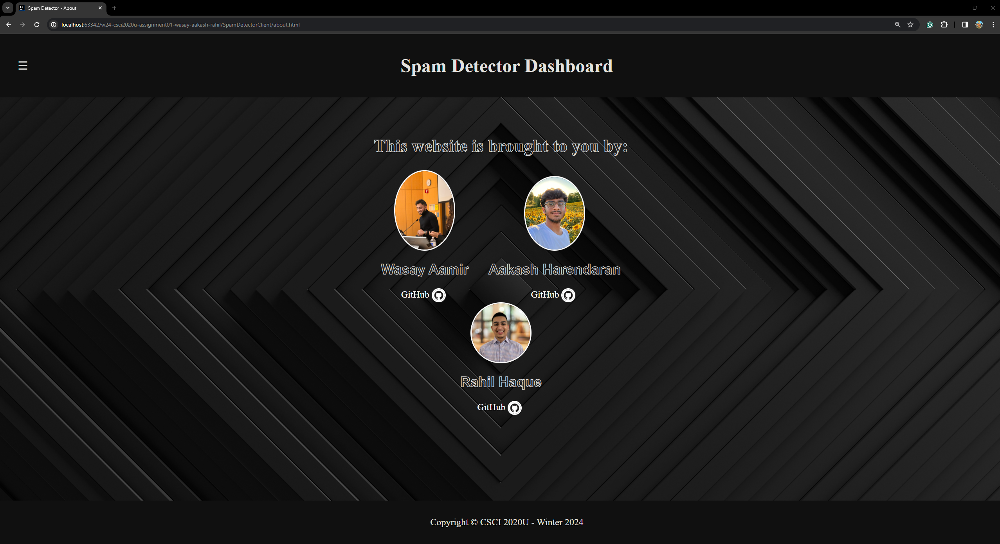

# Spam Detector 🛡️

## Project Information
This project aims to create a spam detector using a unigram approach to filter out spam emails. The program uses a dataset of emails (spam or ham) to train the system, calculating probabilities based on each word's frequency.

### Screenshots

#### Dashboard


#### About Me Page


### Group Members
- Wasay Aamir
- Aakash Harendran
- Rahil Haque

## How to Run ▶️
1. Clone the repository:
    ```bash
    git clone <repository-url>
    cd <repository-folder>
    ```

2. Open the project in your preferred IDE (IntelliJ is recommended).

3. Edit configurations in your IDE to run the server 

4. Run the server to train and test the spam detector.

5. Open the `SpamDetectorClient` and navigate to index.HTML

6. Open up in your preferred browser

## Improvements
 
### About Page Enhancement 🚀
- **Added Team Member Pictures:**
  - Incorporated pictures of team members on the "About" page.
  - Provides users with a visual representation of the project contributors. 📸

- **GitHub Profile Links:**
  - Linked individual GitHub profiles to enhance transparency and allow users to explore team credentials easily. 🔗

- **Visual Appeal:**
  - Enhanced the visual presentation of `index.html` and `about.html` for a more engaging user experience. 🎨

### Styling Improvements 🎨
- **Updated main.css:**
  - Ensured pleasing color schemes to improve the overall aesthetic of the application. 🌈
  - Added a hover effect on the "Spam Detect Analysis" table. ✨

### Backend Enhancement 💻
- **Optimized Threshold Calculation:**
  - Utilized the average of spam probabilities as a threshold for calculating accuracy and precision.
  - This approach provides more direct and meaningful readings for evaluating the effectiveness of the spam detection model. 📊

## Project Structure 🏗️
The project is divided into two main components:
- **SpamDetectorServer:** Handles the training and testing of the spam detector.
- **SpamDetectorClient:** Provides the interface for interacting with the spam detector.

## Data 📊
The training and testing data are located in the `resources` folder of the `SpamDetectorServer` project. The data is divided into `train` and `test` folders.

## References 📚
[1] Sidebar Interface: [https://www.w3schools.com/w3css/w3css_sidebar.asp](https://www.w3schools.com/w3css/w3css_sidebar.asp)
[2] Hover Effect: [https://www.w3schools.com/cssref/sel_hover.php](https://www.w3schools.com/cssref/sel_hover.php)
[3] Spam Filtering: [https://en.wikipedia.org/wiki/Naive_Bayes_spam_filtering](https://en.wikipedia.org/wiki/Naive_Bayes_spam_filtering)

